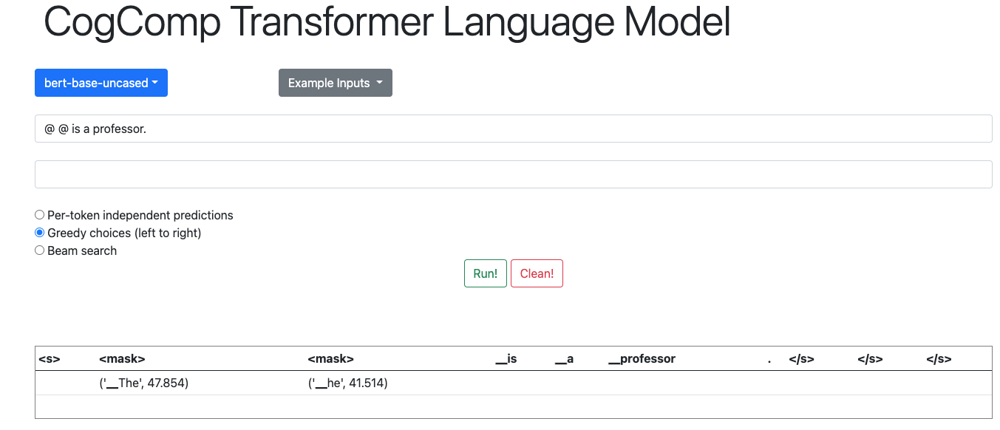

# BERT demo

This is how it should look like: 




### Using the code 

```
> python -m spacy download en_core_web_sm
```

### Running the demo 
To install the python dependencies, simply do: 
```python 
pip3.6 install -r requirements.txt
```

- Check if Django is installed:
 ```
 $ python -m django --version
 ```
 
 - Run the app: 
```
$ python3.6 manage.py runserver
```


